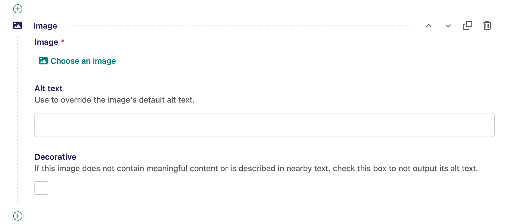

# Step Seven: Best Practices for Images and Alt Text

The next major topic is one you've probably heard about if you've done web development for a decent amount of time: alt text!

If you're not familiar, alt text is a way to provide a _textual alternative_ of an image to screen readers, not displayed visibly, so that people who cannot see the image can hear what it is depicting. This is done using the `alt` attribute on an `img` element.

The key question to ask yourself when considering alt text for an image is, "What description of this image would be useful to someone who's hearing this page read aloud?" And bear in mind that the answer may be _none._ Decorative images do not need alt text if hearing a description of them would not be useful. However, all `img` elements should have an `alt` attribute, and it should be left empty if the image is decorative.

You can find many many articles on when and how to use alt text, but let's discuss how to implement it in Wagtail. Note: The stock implementation of alt text in Wagtail is under active development, so we'll try to give the best advice we can as of the date of this tutorial.

Wagtail has never had a field for alt text in its default image model, but as we noted earlier, it will default to using an image's title for the alt text if you render an image with Wagtail's standard `` template tag. This isn't great, because the title you want to see in the admin interface may have no relation to useful alt text.

Our current recommendation is three-fold:

1. Add an default alt text field to a custom image model, which we already did in step 3, and use that instead of the image's title field
2. Add alt text fields and "is decorative" checkboxes alongside image choosers in the context of your page content
3. Write your templates to use the in-context alt field, if present, or fall back on the default alt text from the model

Any given image may be used in multiple places on a site, and it's important that alt text be relevant to the context the image is in, so we want to prioritize the alt text entered at the point where an image is used (or respect the decision that the image needs no alt text), but where neither of those things are true, use the default alt text for that image.


## Creating a custom image block

For Wagtail StreamFields, the best approach for adding alt text in context is to create a custom image block that incorporates an image chooser, an optional alt text field, and a checkbox to mark an image as decorative (not needing alt text).

When initially setting up our StreamField, we added an image option to it using Wagtail's built-in `ImageChooserBlock`, which simply creates a button you can use to select an image from your library. We'll replace that with a custom StructBlock, like our `HeadingBlock`, that combines the `ImageChooserBlock` with our two new fields.

In your `blocks.py` file, first add `Boolean` to the list of things being imported from `wagtail.blocks`:

```python
from wagtail.blocks import (
    BooleanBlock,
    # ...
)
```

Then create a new `ImageBlock` class, subclassing `StructBlock`, with three child blocks for the image chooser, alt text, and decorative flag:

```python
class ImageBlock(StructBlock):
    image = ImageChooserBlock()
    alt_text = CharBlock(
        required=False,
        help_text="Use to override the image's default alt text.",
    )
    decorative = BooleanBlock(
        required=False,
        help_text="If this image does not contain meaningful content or is described in nearby text, check this box to not output its alt text.",
    )
    
    class Meta:
        icon = 'image'
        template = 'blocks/image_block.html'
```

Note that `alt_text` and `decorative` must be set to `required=False` for our block to work as planned.

Finally, switch the `image` of the `BaseStreamBlock` to use our new `ImageBlock` instead of the standard `ImageChooserBlock`:

```python
class BaseStreamBlock(StreamBlock):
    heading = HeadingBlock()
    paragraph = RichTextBlock()
    image = ImageBlock()  # updated from ImageChooserBlock
    # ...
```

With that set, you can see our new block now available in our blog page's StreamField:



Now we need to create the block template for it to show up in the front end. Create a new file named `image_block.html` in `myblog/templates/blocks` and copy this content into it:

```django



    

    

    

```

The logic here is:

1. If an image is marked as decorative, we'll set the alt text to empty so screen readers will ignore it.
2. If if that's not the case, set the alt text to the alt text specified in the block, if there is any.
3. Otherwise, fall back on the image's default alt text stored on the image in the image library.

Create one of these blocks in your blog post, upload an image from your computer, and play around with the different configurations, checking the result on the frontend.


## Adding custom validation to assist editors

You may have noticed that there is no indication in the editing interface that the decorative checkbox will take precedence over the block-level alt text field. We could add even more help text to indicate that, but users would still be able to both populate the block's alt text field and check the decorative checkbox. To make things extra clear for our users, we can again utilize custom validation.

### Validating either alt text or decorative, not both

We'll do this using a very similar pattern to the way we created the custom heading level validation in the previous step. First, in `blocks.py`, add `StructBlockValidationError` to the list of imports from `wagtail.blocks`:

```python
from wagtail.blocks import (
    # ...
    StructBlockValidationError,
)
```

Then we'll set up the custom `clean()` method in our `ImageBlock` class:

```python
class ImageBlock(StructBlock):
    # ...
    def clean(self, value):
        result = super().clean(value)

        if result["alt_text"] and result["decorative"]:
            raise StructBlockValidationError(
                block_errors={
                    "alt_text": ValidationError(
                        "Marking an image as decorative will override alt text entered here. Empty this field or uncheck the decorative box."
                    )
                }
            )

        return result
```

Now if you try to save the block with both alt text and the decorative flag set, you'll receive an error and be prompted to only set one or the other.

If you find this heavy-handed, that's OK! Adding help text may be perfectly adequate, depending on the editors you'll be working with.

### Preventing bad alt text

Another potential use of custom validation for alt text is preventing the entry of bad alt text. For example, alt text beginning with phrases like "picture of" or "image of" should be avoided, because screen readers already indicate to their users that what they are about to read is the alt text of an image. We can add to our custom `clean()` method to address this:

```python
    def clean(self, value):
        result = super().clean(value)

        if result["alt_text"] and result["decorative"]:
            raise StructBlockValidationError(
                block_errors={
                    "alt_text": ValidationError(
                        "Marking an image as decorative will override alt text entered here. Empty this field or uncheck the decorative box."
                    )
                }
            )

        phrases = (
            "graphic of",
            "image of",
            "pic of",
            "picture of",
            "photo of",
            "photograph of",
        )
        if result["alt_text"].casefold().startswith(phrases):
            raise StructBlockValidationError(
                block_errors={
                    "alt_text": ValidationError(
                        'Do not start alt text with redundant phrases like "Image of…".'
                    )
                }
            )

        return result
```

There are more potential ways one could think about to validate whether entered alt text is good or not, but that is probably the biggest one.


## Using `StructValue` to simplify template logic

Looking back at our block template, that's some pretty gnarly logic to put in a template. Let's move some of that into Python using Wagtail's `StructValue` concept.

`StructValue` is a means of adding custom data to a StructBlock, in addition to the standard values of its child blocks.

We'll continue working in `blocks.py`. First, add the `StructValue` base class to your list of `wagtail.blocks` imports:

```python
from wagtail.blocks import (
    # ...
    StructValue,
)
```

Now create a subclass of `StructValue` that we'll use to compute what we want the alt text to be depending on which field in the block is set, if any. Place this above your `ImageBlock` class:

```python
class ImageStructValue(StructValue):
    def alt(self):
        if self.get("decorative"):
            return ""
        else:
            return self.get("alt_text") or self["image"].default_alt_text
```

Then we must attach the `ImageStructValue` to the `ImageBlock` by adding a new `value_class` attribute to its `class Meta`:

```python
class ImageBlock(StructBlock):
    # ...
    class Meta:
        icon = "image"
        template = "blocks/image_block.html"
        value_class = ImageStructValue
```

Finally, we can dramatically simplify our `image_block.html` template to call the new `alt` value from the `ImageStructValue`:

```django



```

Much cleaner! Conventional wisdom in the Django community encourages moving as much logic as possible out of your templates and into Python, but both approaches work, and it's ultimately up to you to decide what you prefer.


## The future of alt text in Wagtail

What we went through above is the current best practice for handling image alt text in Wagtail, but there is an active effort underway to further improve Wagtail's default alt handling. We have just launched a Google Summer of Code project to implement [RFC 51](https://github.com/wagtail/rfcs/pull/51), focused on providing a default alt text field on the image model, an easy way to hook that up to an AI tool for automatically populating it using a large vision model, and an easier way to add alt text in context, without creating your own custom image block on every site. Stay tuned!


---

[Continue to Step 8](https://github.com/vossisboss/pyconwagtail2024/tree/step-8)
