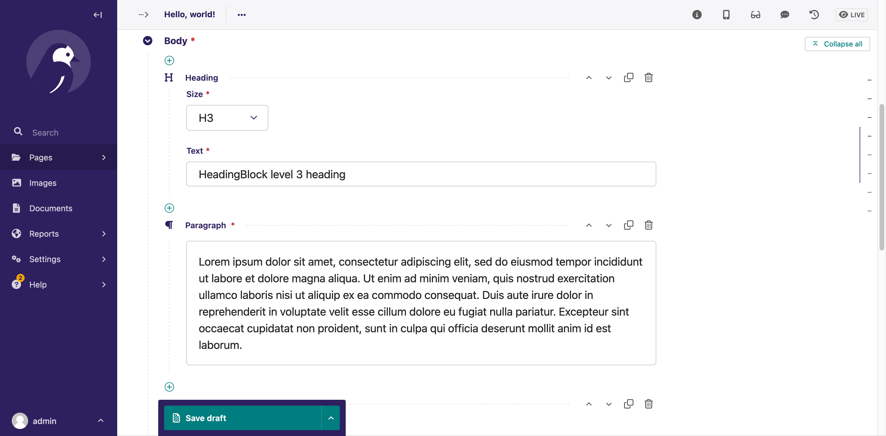

# Step Four: Creating a basic blog

:warning: **Do not change any of the identifiers** (model or field names) in the given code snippets, or the data import script we offer to speed up the process of creating your demo blog pages will not work.

* * *

Now that you've extended the Home page and added some custom models that we'll need, we're going to work on building out a blog. We provided a foundation in the project template to save some time, so let's head over to the `blog` directory and have a look at what's inside it.


* * *

## :memo: A quick note on project structure :memo:

In Wagtail projects, it is generally a good idea to keep related models in separate apps because it makes it a little easier for you to manage changes that affect migrations. Also, it makes it a little easier to decide where to put new code or models. Some Wagtail developers like to use a "core" or "base" app for models that are used across their projects. Others prefer not to use that approach because it can make future migrations a little trickier to manage. Both approaches are valid! For this workshop though, we're using the separate app approach.

* * *

## Our blog page models

Navigate to `blog/models.py`. You'll find models for two new page types for your blog. Wagtail is a CMS that uses a tree structure to organize content. There are parent pages and child pages. The ultimate parent page by default is the Home page. All other page types branch off of the Home page. Then child pages can branch off of those pages too.

The first page type you'll see is a parent type for the blog called `BlogIndexPage`. You don't have to use `Index` or `Page` in the name, but most Wagtail developers use those conventions because they help keep things organized. Here's what the code for `BlogIndexPage` looks like:

```python
class BlogIndexPage(Page):
    intro = RichTextField(blank=True)

    content_panels = Page.content_panels + [
        FieldPanel('intro')
    ]

    subpage_types = ['blog.BlogPage']
```

This is a very simple version of `BlogIndexPage`. You'll be adding a few more things to it later, but this will work right now for getting your blog set up. We also added a setting called `subpage_types` that will link `BlogIndexPage` to a specific child page type. It's unlikely that blog editors will be creating any other page types connected to `BlogIndexPage`, so adding this setting improves their user experience by reducing the number of clicks they have to make to set up a page.

The second page type in the file is called `BlogPage`. The code looks like this:

```python
class BlogPage(Page):
    date = models.DateField("Post date")
    intro = models.CharField(max_length=250)
    body = RichTextField(blank=True)

    search_fields = Page.search_fields + [
        index.SearchField('intro'),
        index.SearchField('body'),
    ]

    content_panels = Page.content_panels + [
        FieldPanel('date'),
        FieldPanel('intro'),
        FieldPanel('body'),
    ]

    parent_page_types = ['blog.BlogIndexPage']
```

Think about the fields you typically need for a reader to enjoy a blog post. The title is included in a Wagtail model by default, so what else is usually needed? Blogs can get pretty messy without dates to organize them, so we added a `date` field. We also added an `intro` field to help readers get a preview of what the blog post is about. Note that the `intro` field has a `max_length` setting to keep editors from being too longwinded. A `body` field is pretty key for a blog, too, because otherwise there isn't a place to put any of your content. We're also added the `parent_page_types` setting to link `BlogPage` to `BlogIndexPage`.


## Making fields searchable

You're probably wondering what this chunk of code in `BlogPage` does:

```python
    search_fields = Page.search_fields + [
        index.SearchField('intro'),
        index.SearchField('body'),
    ]
```

This code is telling Wagtail which fields you would like to be searchable. For the most part, you want users to be able to search as many fields as possible to help them find what they need. But there are some occasions where you don't want content to be indexed in the website search.


## Templates for your blog

You're probably noticing a trend how things are set up in Wagtail. You create models to organize your data then pair them with a set of templates that determined how that data is displayed in HTML on your webpage. We pre-loaded two basic templates for `BlogIndexPage` and `BlogPage`. You can have a look at those in the `myblog/templates/blog` folder. Remember where they are because we will be coming back to them to modify the templates and make them better for accesssibility.


## Adding Wagtail StreamField

One of the best parts of Wagtail is [StreamField](https://docs.wagtail.org/en/stable/topics/streamfield.html). StreamField gives users the power to mix and match different "blocks" of content rather than having a strict structure for a page. For example, someone writing a blog post could add a "quote" block to highlight a particular quote or phrase from their post. Or they could add a "sidebar" block that includes a little extra bonus content on the page. There aren't many limits to the types of blocks you can create.

To show you StreamField in action, you're going to create a simple StreamField implementation in the blog post `body` using some of the [default blocks](https://docs.wagtail.org/en/stable/reference/streamfield/blocks.html) that come with Wagtail. First, update your import statements in your `models.py` file so they look like this:

```python
from django.db import models

from wagtail.models import Page
from wagtail.fields import RichTextField, StreamField
from wagtail.admin.panels import FieldPanel
from wagtail.search import index
from wagtail.embeds.blocks import EmbedBlock
from wagtail import blocks
from wagtail.images.blocks import ImageChooserBlock
```

Then, at the top of the file under the imports, add this one custom block that we'll start with:

```python
class HeadingBlock(blocks.StructBlock):
    size = blocks.ChoiceBlock(
        choices=[
            ("h2", "H2"),
            ("h3", "H3"),
            ("h4", "H4"),
        ],
    )
    text = blocks.CharBlock()

    class Meta:
        icon = "title"
        template = "blocks/heading_block.html"
```

Note that this block has its own template defined that tell's Wagtail how to render it. Create a file at `myblog/templates/blocks/heading_block.html` and add this one line to it:

```django
<{{ self.size }}>{{ self.text }}</{{ self.size }}>
```

Next, update the `body` field definition in your `BlogPage` class, replacing `RichTextField` with a `StreamField` with four block types:

```python
    body = StreamField(
        [
            ("heading", HeadingBlock()),
            ("paragraph", blocks.RichTextBlock()),
            ("image", ImageChooserBlock()),
            ("embed", EmbedBlock(max_width=800, max_height=400)),
        ]
    )
```

Your whole file should now look like this:

```python
from django.db import models

from wagtail.models import Page
from wagtail.fields import RichTextField, StreamField
from wagtail.admin.panels import FieldPanel
from wagtail.search import index
from wagtail.embeds.blocks import EmbedBlock
from wagtail import blocks
from wagtail.images.blocks import ImageChooserBlock


class HeadingBlock(blocks.StructBlock):
    size = blocks.ChoiceBlock(
        choices=[
            ("h2", "H2"),
            ("h3", "H3"),
            ("h4", "H4"),
        ],
    )
    text = blocks.CharBlock()

    class Meta:
        icon = "title"
        template = "blocks/heading_block.html"


class BlogIndexPage(Page):
    intro = RichTextField(blank=True)

    content_panels = Page.content_panels + [
        FieldPanel('intro')
    ]

    subpage_types = ['blog.BlogPage']


class BlogPage(Page):
    date = models.DateField("Post date")
    intro = models.CharField(max_length=250)
    body = StreamField(
        [
            ("heading", HeadingBlock()),
            ("paragraph", blocks.RichTextBlock()),
            ("image", ImageChooserBlock()),
            ("embed", EmbedBlock(max_width=800, max_height=400)),
        ]
    )

    search_fields = Page.search_fields + [
        index.SearchField('intro'),
        index.SearchField('body'),
    ]

    content_panels = Page.content_panels + [
        FieldPanel('date'),
        FieldPanel('intro'),
        FieldPanel('body'),
    ]

    parent_page_types = ['blog.BlogIndexPage']
```

Save your file and then run the migration commands `python manage.py makemigrations` and `python manage.py migrate`.


## Load some demo pages

Rather than creating your own blog index and blog pages, we provided a script to load some practice content into your database. Running our script will also give you an example accessibility issue that we'll look at later in this workshop.

Run `python manage.py seed_data` in your terminal to load up our demo `BlogIndexPage` with a child `BlogPage`.

If it's not still running, start up the development server real quick with `python manage.py runserver`, then visit the admin (http://127.0.0.1:8000/admin/) have a look at the Demo Blog Index and "Hello, world!" pages that the seed script created.

You'll notice that the "body" section in the blog page has several blocks with green plus icons between them. When you click one of those, a collection of blocks will appear for you to choose from. Feel free to create a new blog page under the Demo Blog Index and experiment with combining blocks, but leave the ones on "Hello, world!" alone so that we can use them for demonstrating accessibility fixes later.



You can also click the **Live** button at the top right of our demo pages to take a peek at how they are rendered on our front end.

We're now done with the basic Wagtail set up and ready to move on to making our simple blog more accessible than it currently is!


* * *

[Continue to step 5](https://github.com/vossisboss/pyconwagtail2024/tree/step-5)
