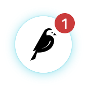
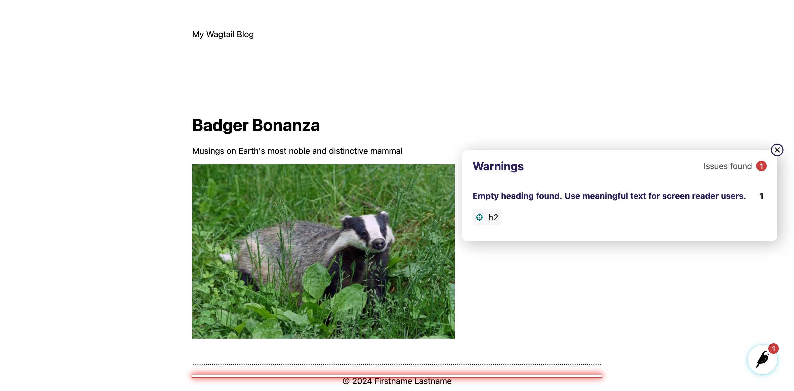

# Step Five: Using the Wagtail Accessibility Checker

[Wagtail's built-in accessibility checker](https://guide.wagtail.org/en-latest/releases/new-in-wagtail-4-2/#built-in-accessibility-checker) (added in Wagtail 4.2 in January 2023) is the hallmark feature of our efforts to improve the accessibility of sites made with Wagtail. It's based on [the Axe engine from Deque Systems](https://www.deque.com/axe/). Axe is a tool that can run a wide range of automated accessibility tests. Aside from having [its own browser extension](https://www.deque.com/get-started-axe-devtools-browser-extension/), they have open-soured their framework for other tools to be able to use it under the hood. One example is [Google's Lighthouse](https://developer.chrome.com/docs/lighthouse/overview), and as noted, it also powers the Wagtail accessibility checker.

The goal of Wagtail's accessibility checker is to make it easy for content editors to identify accessibility issues that they can address themselves. To try it out, open the frontend of your site at http://127.0.0.1:8000 and look for the Wagtail user bar in the lower right corner. You might have spotted this in previous steps, but thanks to some intentional mistakes included in the template code we provided you, you should see a red badge on the Wagtail icon indicating one error on the page:



Open up the user bar and click on the **Accessibility** item to show what errors it found. For each error it located, you can click on the button showing the tag name with a crosshair icon to highlight that part of the page.



In this case, it's telling us that there is an empty heading, and it's pointing at the `<h2>` in the footer of the page, but that's actually not the _only_ error we introduced! Some of them aren't being displayed because, as mentioned previously, the accessibility checker is meant for editors to find things that they can correct in their content, so its default configuration leaves out many of the errors that Axe can display but that only a developer can address.

As developers, we recommend that you enable the display of all possible errors when you are logged in as an admin-level user, so that you can be made aware of those errors that you should fix in your code. To do that, we'll use one of Wagtail's [hooks](https://docs.wagtail.org/en/stable/reference/hooks.html) to customize the behavior of the accessibility checker depending on user level.

Copy this code and paste it into a new `wagtail_hooks.py` file in your `home` app folder:

```python
from wagtail import hooks
from wagtail.admin.userbar import AccessibilityItem


class CustomAccessibilityItem(AccessibilityItem):
    def get_axe_run_only(self, request):
        # Do not limit what rule sets run if the user is a superuser
        if request.user.is_superuser:
            return None
        # Otherwise, use the default rule sets
        return AccessibilityItem.axe_run_only


@hooks.register("construct_wagtail_userbar")
def replace_userbar_accessibility_item(request, items):
    items[:] = [
        CustomAccessibilityItem() if isinstance(item, AccessibilityItem) else item
        for item in items
    ]
```

Wagtail will automatically load any `wagtail_hooks.py` files that it finds within app folders, and when it loads this one, it will use the `construct_wagtail_userbar` hook to replace the stock `AccessibilityItem` with the `CustomAccessibilityItem` that we subclassed from it above.

After saving the file, stop and restart your development server (Ctrl+C, then `python manage.py runserver`) in order to get Wagtail to pick up on the new hooks file. Then refresh your homepage and you will see a new error: "All page content should be contained by landmark". ([Landmarks](https://developer.mozilla.org/en-US/docs/Web/Accessibility/ARIA/Roles/landmark_role) are used by assistive technology to help users navigate between the major areas of a page.) This is an example of the kind of error that can't be addressed by an editor and must be addressed by a developer through changing the template code.

We have two instances of this error to take care of: the header and the main content area. For the header, we could solve this by applying a `role="banner"` attribute to the wrapping `div`, but a better practice is to use newer HTML elements with semantic meanings and implicit landmark roles. Instead of adding `role` attribute, the Let's change the element that's wrapping our site header from a `div` to `header`.

In `myblog/templates/base.html`, update the header area to look like this:

```django
        <header class="header">
            My Wagtail Blog
        </header>
```

The main content area (``) is currently also wrapped in a `div`, so let's contain all of the rest of the page content by swapping that to a `main` element (again in `myblog/templates/base.html`):

```django
        <main id="main">
            
        </main>
```

(The `id="main"` also provides a convenient hook for adding a [skip link](https://webaim.org/techniques/skipnav/), which we won't be doing in this tutorial, but you should definitely look into!)

Save those changes, refresh your homepage in the browser, and you should see the landmark error has cleared!

Returning to the empty heading error, this one can be solved in the Wagtail admin. It's looking for the site's name, but sites in Wagtail are not given names by default. To fix it, go to the site settings at http://127.0.0.1:8000/admin/sites/edit/2/ and put something in the site name field, like "Badger Bonanza" or "My Wagtail Site". After saving that, refresh the homepage in your browser and see that the site name you just entered has appeared in the footer, and the accessibility checker is no longer reporting any issues.

---

Now that we have tried out the Wagtail accessibility checker and fixed some issues that it's reported, let's dig deeper on some of the most common accessibility issues that we see out there.

[Continue to Step 6](https://github.com/vossisboss/pyconwagtail2024/tree/step-6)
